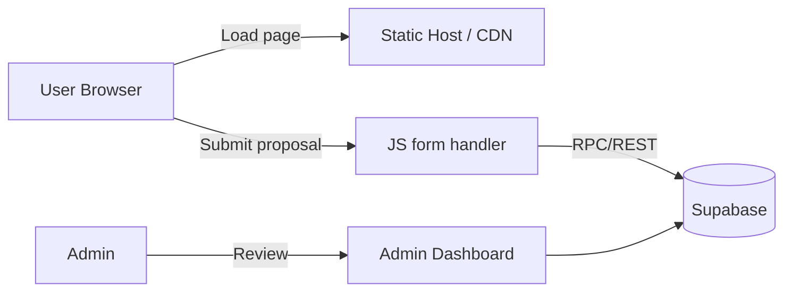

# StudentHub — Project Documentation

## Overview

StudentHub is a collaborative frontend prototype for students to publish, browse, and propose projects. It is a static-site based app with JS-driven pages and an optional Supabase backend for authentication and persistence.

## Key Features

- Browse curated student projects and organizations.
- Submit project proposals via a proposal form (stored to Supabase when configured).
- User authentication and session handling using Supabase (see `utils/supabase`).
- Admin interface for reviewing and accepting proposals (`admin.html`).
- Static, easy-to-host frontend built from plain HTML/CSS/JS assets.
- Linting and formatting with `eslint` and `prettier`; tests with `jest`.

## Tech Stack

- Frontend: Static HTML, CSS, and vanilla JavaScript (files under `pages/` and `assets/js/`).
- Storage/Auth: Supabase (client wrappers in `utils/supabase/`).
- Tooling: Node.js dev tools for linting/testing; scripts defined in `package.json`.

## Repository Structure (high level)

- `pages/` — HTML pages served to users (e.g., `projects.html`, `login.html`, `admin.html`).
- `assets/` — Static assets: `css/` and `js/` source files.
- `utils/supabase/` — Supabase client and server middleware wrappers.
- `docs/` — Project documentation (this file and others like [ARCHITECTURE.md](docs/ARCHITECTURE.md)).
- `__tests__/` — Unit and integration tests.
- Top-level files: `index.html`, `README.md`, `package.json`, `CONTRIBUTING.md`.

## Pages and UX Flow

- `index.html` — Landing page and entrypoint.
- `projects.html` — Browse projects and view details.
- `proposals.html` — Submit a new project proposal.
- `login.html` — Sign in via Supabase; used to authenticate authors and admins.
- `admin.html` — Admin dashboard to review proposals and manage content.

Typical user flow:

1. Visitor lands on `index.html` and navigates to `projects.html`.
2. To submit a project, user goes to `proposals.html` and fills the form.
3. If the app is configured with Supabase, the form submits via the client and creates a record.
4. Admins sign in through `login.html` and access `admin.html` to approve or reject proposals.

## Architecture & Data Flow

See [docs/ARCHITECTURE.md](docs/ARCHITECTURE.md) for a more detailed diagram. In short:

- Frontend sends read/write requests to Supabase through `utils/supabase/client.ts`.
- `utils/supabase/middleware.ts` and `server.ts` contain optional server-side helpers for SSR or protected endpoints.
- Data stored in Supabase: projects, proposals, user profiles, and organization metadata.

Mermaid diagram (simplified):



## Developer Setup

Prerequisites: Node.js (LTS), npm.

Install dependencies:

```
npm install
```

Available scripts (from `package.json`):

- `npm run start` — serve the repo locally using `serve`.
- `npm run lint` — run `eslint` over `assets/js`.
- `npm run format` — run `prettier --write .` to format files.
- `npm run test` — run tests with `jest`.
- `npm run prepare` — installs `husky` git hooks (run automatically on install).

Local development (quick start):

1. `npm install`
2. `npm run start`
3. Open `http://localhost:5000` (or the port printed by `serve`) to view the site.

Testing and quality:

- Run `npm run lint` and `npm run format` before committing.
- Tests are located in `__tests__/` and run via `npm test`.

## Supabase Configuration

The app contains Supabase helper files in `utils/supabase/`:

- `client.ts` — initializes the Supabase client used by frontend code.
- `middleware.ts` — request middleware for server integrations.
- `server.ts` — server-side helper functions (optional).

To enable Supabase functionality:

1. Create a Supabase project and copy the `SUPABASE_URL` and `SUPABASE_ANON_KEY`.
2. Provide those keys to the client (e.g., via environment variables when doing SSR, or by configuring the client at startup).
3. Ensure database tables exist for `projects`, `proposals`, and `users` as used by the frontend code.

Security note: Never commit secret keys. Use environment variables or CI secret storage when deploying.

## Admin and Contributor Workflow

Contributor flow:

1. Fork the repo and create a feature branch.
2. Implement changes locally; run `npm run lint` and `npm run format`.
3. Add tests for new behavior in `__tests__/`.
4. Open a Pull Request against the main repo and reference any issue.

Admin flow for proposals:

1. Admin signs in via `login.html` (backed by Supabase auth).
2. Admin opens `admin.html` to review pending proposals.
3. Admin approves a proposal (moves it from `proposals` to `projects` table or sets an approved flag).

## Deployment

StudentHub is a static-first site and can be hosted on any static hosting platform (Netlify, Vercel, GitHub Pages, Cloudflare Pages). If Supabase is used, you will need to configure CORS and the public keys appropriately.

Basic deployment steps:

1. Build/prepare static assets (if any build step is added).
2. Push to the hosting platform following their instructions.
3. Add environment variables (Supabase keys) in the host if required for server-side actions.

## Contribution & Governance

Follow the existing `CONTRIBUTING.md` for commit, PR and review norms. Use `lint-staged` and `husky` to run checks pre-commit.

## Next Steps & Recommendations

- Add end-to-end tests for major user flows (browse, submit, admin approve).
- Add CI that runs `npm test`, `npm run lint`, and `npm run format` on PRs.
- Consider a simple build step (Webpack/Rollup/Vite) if you add modern JS features.

---

For architecture details see [docs/ARCHITECTURE.md](docs/ARCHITECTURE.md). For setup instructions see [docs/SETUP.md](docs/SETUP.md).
